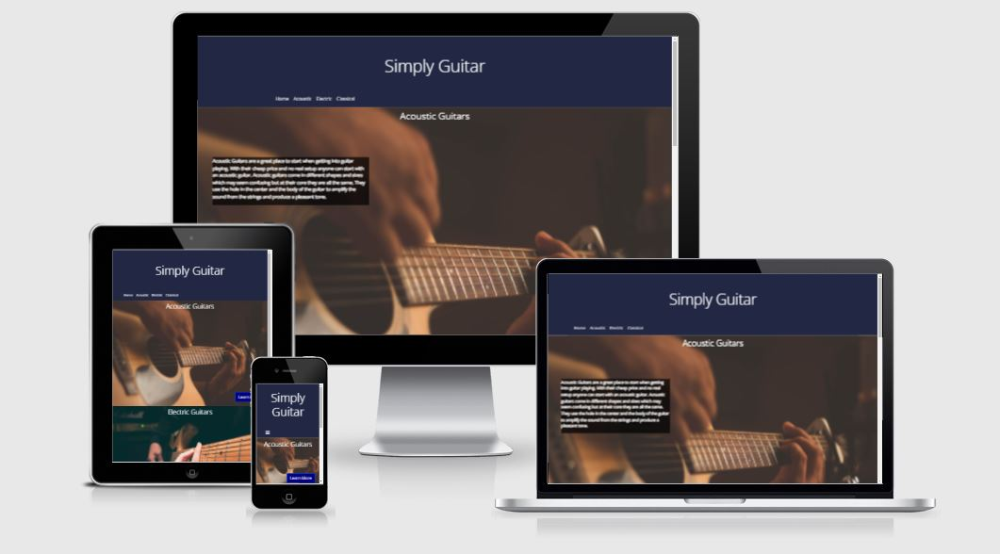

<h1 align="center">Simply Guitar</h1> 

This website is designed to inform aspiring guitar players on the basics of guitar. The website will take them through the basics of each type of guitar as well as point them towards external learning resources. [Link to live version of site](https://kieran-bourke.github.io/Milestone-project-1/)  

<h2 align="center"></h2>
---  

## UX  

 - ## User stories   

     - ###  First time visitor goals 

    1. To easily understand the purpose of the website. 

    2. To be able to easily navigate between pages. 

    3. To be able to easily and quickly find the information they are looking for.  


  - ### Returning Visitor goals 

    1. To be able to quickly navigate to the pages they want. 

    2. To feel comfortable with the website and its features. 

    3. To feel comfortable using the contact form if anything is not working.   


 - ### Frequent user goals 

    1.To be able to quickly navigate to the pages they want. 

    2.To feel comfortable with the website and its features. 

    3.To understand the differences in guitar types and feel confident in recommending the site.  


## Design  

###  color scheme 

- colors used for background orange (#CE4027) and dark blue (#222844), an white color was used for the text (#ffffff) 


### Typography 

-   Open sans was used thought the website, with sans serif used as a backup incase open sans will not load. 


### Imagery  

- Imagery is used to gain the users attention while also giving a greater idea about what each section is about. It is also used to help the user understand the small  

differences between the different guitars.   
 

## Wireframes  

### Desktop Wireframe 

 [Desktop](assets/wireframes/desktop-wireframes.JPG) 


### Mobile Wireframe 

 [Mobile](assets/wireframes/mobilewireframe.JPG) 


--- 

 - ## Features 

    - Responsive on all device sizes 

    - Playable audio  

    - Contact form 

    - Guitar tabs 


## Technologies Used  

---  

 ### Languages Used   

 - HTML5 

 - CSS3   
 

## Frameworks, Libraries & Programs Used   

1. Bootstrap 4.2.1 : 
    -   I used bootstrap to create responsive designs. 

2. Font Awesome  
    -  Font Awesome was used for the social media icons and hamburger navigation icon. 

3. Git: 
    -   Git was used to Update and access versions using Gitpod to push to GitHub. 

4. GitHub: 
    -  GitHub is used to store the code for the project. 

5. Balsamiq: 
    -  Balsamiq was used to create the wireframes for the project. 

6. jQuery 3.2.1  
    - jQuery was used to make the collapsible navigation.  
 

## Testing  

--- 
 

I used W3C Markup Validator and W3C CSS Validator to ensure my code was free of syntax errors. 


 [W3C Markup Validator](https://validator.w3.org/#validate_by_input)[- index.html](assets/w3c-validators/index-html-validator.JPG)   

 [W3C Markup Validator](https://validator.w3.org/#validate_by_input)-[acoustic.html](assets/w3c-validators/acoustic-validator.JPG)   

 [W3C Markup Validator](https://validator.w3.org/#validate_by_input)[- electric.html](assets/w3c-validators/electric-validator.JPG)   

 [W3C Markup Validator](https://validator.w3.org/#validate_by_input)[- classical.html](assets/w3c-validators/classical-validator.JPG)   

 [W3C Markup Validator](https://validator.w3.org/#validate_by_input)[- contact.html](assets/w3c-validators/contact-validator.JPG)   

 [W3C CSS Validator](https://jigsaw.w3.org/css-validator/)[- style.css](assets/w3c-validators/css-validation.JPG) 


 ### Testing User Stories From User Experience (UX) Section  

- #### First Time Visitor Goals  

  1. To easily understand the purpose of the website.  

        1. Upon entering the site the user is greeted by the title Simply Guitar a navigation bar and a large image of an acoustic guitar. 

        2. The large image of the acoustic guitar as well as the brief acoustic guitar overview makes it easy to understand what the site will be like.  

        3. If the user scrolls down, they will see a Learn more button as well as 2 other sections for different guitars.   
 

  2. To be able to easily navigate between pages.  

        1. When entering the site, the user is greeted with a visible navigation bar which is consistent across pages. 

        . If the user scrolls down, they will see a Learn more button that takes them to the other pages.  

        3. If the user scrolls all the way down to the bottom of the page, they will see navigation links within the footer.   


  3. To be able to easily and quickly find the information they are looking for.      

        1. The user can quickly jump to the page that they desire by clicking the links.  

        2. Page layouts are consistent across all information pages leading to an easier time with finding information. 

        3. Each section is titled to make it easier to navigate to the information that you want.  


- ####  Returning Visitor Goals  


    1. To be able to quickly navigate to the pages they want.  

        1. Each link to pages is clear and accurate making it easy to go to the page that you want.  

        2.  There are three different ways to get to move between pages except the contact page. 

        3.  The user has access to all pages from all pages.  
 

  2. To feel comfortable with the website and its features.  

        1. The page features are consistent across the website helping to get used to them quickly. 

        2. The website features are kept simple and similar to other sites as to not throw people off. 

        3. The amount of website features are kept low but useful as to not overwhelm the user. 


  3. To feel comfortable using the contact form if anything is not working.       

        1. The contact form is made similar to contact forms on other websites to make it easier for a user to understand. 

        2. Titles are used to display what is required from the user in each section and the input sections will warn the user if the information is not the required type. 

        3. Place holder text is used to give the user a better understanding of what is needed. 
 

- #### Frequent Visitor Goals 
   

    1. To be able to quickly navigate to the pages they want.  

        1. Each link to pages is clear and accurate making it easy to go to the page that you want.  

        2.  There are three different ways to get to move between pages except the contact page. 

        3.  The user has access to all pages from all pages.   
 

  2. To feel comfortable with the website and its features.  

        1. The page features are consistent across the website helping to get used to them quickly. 

        2. The website features are kept simple and similar to other sites as to not throw people off. 

        3. The amount of website features are kept low but useful as to not overwhelm the user.  
 

  3. To understand the differences in guitar types and feel confident in recommending the site.      

        1. The website uses quick overviews to help the user understand the differences between the guitar types. 

        2. The website displays multiple images to add to the understanding of the differences between guitar types. (Some images need to be changed and positioned) 

        3. The website uses audio to further add to the understanding of the differences between guitar types. (Audio will be added soon)  
 

## Problems I had  

---     

#### Widths  

   - An issue I ran into while working on the index.html page was the overview texts width, I had it set to 33% originally but this caused issues with sizing.  
        I fixed this by making it fit-content and this gave me the look I wanted.   
 

#### Responsive Nav Bar 

  -  I wanted to create a responsive nav bar for mobile that would shrink down into a hamburger icon. This caused a lot of issues as it involved jQuery which is something I had no experience with. It took me a long time to even know what to google but I eventually found a stack overflow post (link in the credits section) that explained what I needed and how to implement it. This problem taught me that how you phrase your question can give you different results on google search.   
 

#### Side Scrolling 

  - When I added a bootstrap form onto contact.html It caused side scrolling. I was unsure how to remove it but also wanted to keep using the bootstrap as it saved me a lot of time. This caused me to search for a solution on stack overflow where I quickly found a solution that I would not have figured out on my own without a lot of time and effort. This taught me that stack overflow covers a large number of topics and that you can find a solution to almost any problem.   
 

#### Z-Index 

   - I ran into a issue where the easy songs section of my site would cover the images. This confused me as I had no idea why this was happening. I then remembered a lesson on z-indexing that allowed me to solve the problem by giving the types section a z-index of 1 and a z-index of 0 to easy songs section.  
 

## Deployment   

---   

### GitHub Pages  

The project was deployed to GitHub Pages using the following steps...  

1. Log in to GitHub and locate the [GitHub Repository](https://github.com/) 

2. At the top of the Repository (not top of page), locate the "Settings" Button on the menu. 

    - Alternatively Click [Here](https://raw.githubusercontent.com/) for a GIF demonstrating the process starting from Step 2. 

3. Scroll down the Settings page until you locate the "GitHub Pages" Section. 

4. Under "Source", click the dropdown called "None" and select "Master Branch". 

5. The page will automatically refresh. 

6. Scroll back down through the page to locate the now published site [link](https://github.com) in the "GitHub Pages" section.  
 

### Forking the GitHub Repository 


By forking the GitHub Repository we make a copy of the original repository on our GitHub account to view and/or make changes without affecting the original repository by using the following steps...  

1. Log in to GitHub and locate the [GitHub Repository](https://github.com/) 

2. At the top of the Repository (not top of page) just above the "Settings" Button on the menu, locate the "Fork" Button. 

3. You should now have a copy of the original repository in your GitHub account. 
 

### Making a Local Clone  

1. Log in to GitHub and locate the [GitHub Repository](https://github.com/) 

2. Under the repository name, click "Clone or download". 

3. To clone the repository using HTTPS, under "Clone with HTTPS", copy the link. 

4. Open Git Bash 

5. Change the current working directory to the location where you want the cloned directory to be made. 

6. Type `git clone`, and then paste the URL you copied in Step 3. 


``` 

$ git clone https://github.com/Kieran-Bourke/Milestone-project-1.git

``` 

7. Press Enter. Your local clone will be created.  

```  

$ git clone https://github.com/Kieran-Bourke/Milestone-project-1.git

>  Cloning into `CI-Clone`... 

> remote: Counting objects: 10, done. 

> remote: Compressing objects: 100% (8/8), done. 

> remove: Total 10 (delta 1), reused 10 (delta 1) 

> Unpacking objects: 100% (10/10), done. 

```  

Click [Here](https://help.github.com/en/github/creating-cloning-and-archiving-repositories/cloning-a-repository#cloning-a-repository-to-github-desktop) to retrieve pictures for some of the buttons and more detailed explanations of the above process. 


## Credits 

---  

### Code  

* Bootstrap4: The Bootstrap library was used throughout the project to make the site responsive. 

* StackOverflow was used to multiple times throughout the project to help solve different problems.    

    1. Learn more button being pushed to bottom right was helped by this [StackOverFlow post](https://stackoverflow.com/questions/5817233/align-button-at-the-bottom-of-div-using-css) 

    2. horizontal scroll [StackOverFlow post](https://stackoverflow.com/questions/17756649/disable-the-horizontal-scroll ) 

    3. hamburger nav [StackOverFlow post](https://stackoverflow.com/questions/45756307/bootstrap-4-toggle-button-not-working/45756392) 
 

### Content  

* Deployment section taken from [Code Institute Sample README](https://github.com/Code-Institute-Solutions/SampleREADME) 

* README layout was taken from [Code Institute Sample README](https://github.com/Code-Institute-Solutions/SampleREADME)  


### Media  

Below are links to all images used on this website. 

-    [Acoustic section background image](https://unsplash.com/photos/fCEJGBzAkrU) 

-    [Electric section background image](https://unsplash.com/photos/D6T3vu5oErs) 

-    [Classical section background image](https://unsplash.com/photos/5UqLk6p0ABI) 

-    [Acoustic & classical guitar image 1 and 3](https://unsplash.com/photos/XGLv2xUwELE) 

-    [Acoustic & classical guitar image 2 and 4](https://unsplash.com/photos/ywul8FFm688) 

-    [electric Stratocaster](https://unsplash.com/photos/ozYO4i92tQE) 

-    [electric telecaster](https://unsplash.com/photos/vcRv5gr_cnI) 

-    [electric les Paul](https://unsplash.com/photos/OzSAqN4MjNE)  


### Acknowledgements  

* My college tutor for helpful feedback. 
* My mentor for helpful feedback. 
 
 
 

 